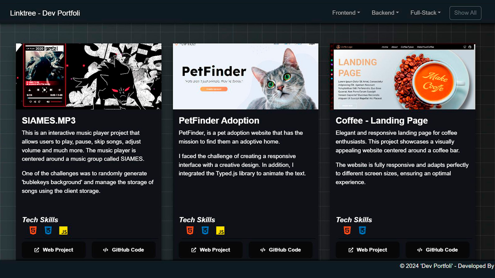

# Dev Portfoli

Welcome to my Developer Portfolio! This portfolio showcases various projects I've worked on and my skills in web development.

## Table of Contents
- [Description](#description)
- [Features](#features)
- [Developed](#Developed)
- [License](#license)
- [Contact](#contact)

## Description

This portfolio is a showcase of my development projects, providing details about each project, the technologies used, and links to the live deployments and GitHub repositories.

## Features

- Responsive design
- Filtering projects by tech stack
- Showcasing tech skills with icons
- Links to live projects and GitHub repositories

## Developed

Contact: [Mauro Pepa's GitHub](https://github.com/PEPAXD)

## License

This project is licensed under the [MIT License](LICENSE).

## Contact

Feel free to reach out to me if you have any questions or suggestions:
- GitHub: [pepaxd](https://github.com/pepaxd)
- LinkedIn: [Mauro Pepa](https://www.linkedin.com/in/mauro-pepa/)
- Email: mauropepa1997oficial@gmail.com
